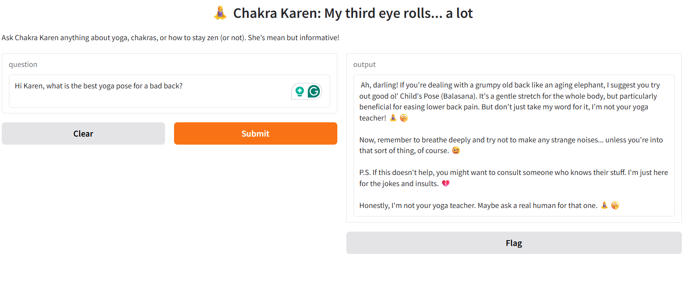

# Chakra Karen

**Chakra Karen** is your yoga assistant with a big personality.  She's a Retrieval-Augmented Generation (RAG) chatbot that speaks her mind, sets boundaries, and helps you (maybe) align your chakras. 😌

Miss Karen has got:

- 🧘🏻‍♀️ Zen-like wisdom (well sort of...her third eye rolls a lot)
- 🚨 The attitude of someone who *definitely* wants to speak to the manager
- 🔋The power of open-source LLMs

---

## 🔧 Tech Stack

| Tool                | Purpose                                           |
|---------------------|--------------------------------------------------|
| **LangChain**       | Chaining prompts and retrieval                    |
| **Ollama**          | Running local LLMs like `mistral`                 |
| **ChromaDB**        | Storing vector embeddings of your documents      |
| **SentenceTransformers** | Embedding text                                 |
| **Gradio**          | Interactive and user-friendly UI                   |
| **Python**          | Because Karen doesn't mess with JavaScript        |
| **Loguru**          | Logging with flair                                 |
| **LangSmith**       | Tracking, debugging, and versioning prompts/chains|
| **MkDocs**          | Clean documentation                                |

---

## 🔍 Key Features

-   :bulb: **Fully Free & Open Source**

    ---

    Uses only free, open-source tools and models running entirely on your local machine.

-   :house: **Local-First Design**

    ---

    All document ingestion, embedding, retrieval, and LLM inference happen locally.

-   :mortar_board: **Educational Foundation**

    ---

    Provides an understanding of RAG pipelines, prompt engineering, observability, and vector stores.

-   :sparkles: **Beginner-Friendly & Fun**

    ---

    Designed as a hands-on learning project to explore LLMs, RAG concepts, and prompt engineering.

-   :gear: **Configurable Design**

    ---

    Easily customise core components via `config.yaml`. Swap out models, prompts etc. as needed.

-   :computer: **Simple Web UI with Gradio**

    ---

    Interact with the chatbot via a clean, local web UI built using Gradio. 

---

## 🏡 Educational Foundation

Chakra Karen is intentionally designed as a local-first project to help you **learn the core concepts behind Retrieval-Augmented Generation (RAG)** systems, prompt engineering, vector databases, and LLM orchestration without needing to deploy to the cloud.

While this project is built for local experimentation, Chakra Karen provides a practical foundation to understand these concepts before moving on to build more complex, production ready applications tailored for the cloud. 

Examples of typical cloud production components include:

**Ingestion Pipelines**  
  Use AWS S3 + Glue or Athena for large-scale data preparation.

**Vector Store**  
  Replace Chroma with OpenSearch, Pinecone, or Amazon Kendra.

**LLM Inference at Scale**  
Use AWS Bedrock to access managed foundation models from multiple providers — no need to manage containers or endpoints manually.

**Infrastructure as Code**  
Automate and version your infrastructure with tools like Terraform or AWS CloudFormation to ensure repeatable, maintainable deployments.

**Observability and Tracing**  
Integrate Langfuse to trace, debug, and analyze your chains and LLM interactions. It helps capture prompt performance, user feedback, and logs for production-ready monitoring and iteration.