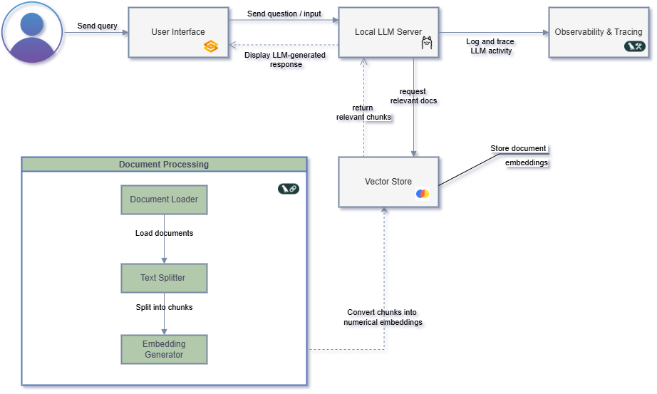

# Project Architecture

This document outlines the architecture of the **Local RAG Chatbot**, including how components interact and the flow of data. 

---

## High-Level Overview

This project is a **local-first Retrieval-Augmented Generation (RAG) chatbot** built with open-source tools. It allows users to query their own documents using an LLM running locally via [Ollama](https://ollama.com/).

---
## Architecture Overview

The diagram below represents the high-level architecture of this local Retrieval-Augmented Generation (RAG) chatbot project. It outlines the core components, from user input through to document processing, retrieval, and response generation and shows how each part interacts to deliver an offline LLM experience.

### Architecture Component Breakdown

Below is a detailed table explaining each component in the RAG chatbot architecture and how it fits into the pipeline.

| **Component**             | **Type**            | **Description**                                                                     | **Tools Used**              | **Notes**                                                                   |
|--------------------------|---------------------|-------------------------------------------------------------------------------------|-----------------------------|-----------------------------------------------------------------------------|
| **User**                 | External Actor      | The person interacting with the chatbot.                                            | N/A                         | Inputs queries through the UI.                                              |
| **Gradio Web UI**        | User Interface      | Web-based interface for real-time interaction with the chatbot.                     | `Gradio`                    | Easy to launch and customise. Runs locally.                                 |
| **Ollama LLM Server**    | LLM Inference       | Processes user queries and generates answers using a local language model.          | `Ollama`                    | Fully offline. Runs models like Mistral, Llama2.                            |
| **LangChain RetrievalQA**| Chain Orchestration | Connects LLM to a retriever, templates the prompt, and manages QA workflow.         | `LangChain`                 | Modular, allows chaining and prompt control.                                |
| **Prompt Template**      | Prompt Engineering  | A text template that defines how context and user input are passed to the LLM.      | `LangChain`, `YAML config`  | Defined using variables like `context` and `question`.                      |
| **Chroma Vector Store**  | Semantic Search     | Stores document embeddings and supports similarity-based retrieval.                 | `ChromaDB`                  | Local-only and fast. Uses collection name and persistence path from config. |
| **Embedding Generator**  | Vectorizer          | Converts document chunks into numerical vectors using pre-trained embedding models. | `SentenceTransformers`      | Uses `all-MiniLM-L6-v2` by default.                                         |
| **Text Splitter**        | Preprocessor        | Breaks long documents into chunks to improve retrieval granularity.                 | `LangChain`                 | Configurable chunk size and overlap.                                        |
| **Document Loader**      | Data Ingestion      | Loads `.pdf` and `.txt` documents from the data directory.                          | `PyMuPDF`, `TextLoader`     | Prepares raw text for splitting.                                            |
| **LangSmith (optional)** | Observability       | Logs prompt usage, responses, and traces for debugging and evaluation.              | `LangSmith`                 | Requires API key and `.env` setup. Controlled via `config.yml`.             |

---
## Observability and Testing

- **Logging**: Loguru is used for detailed debug/info logging during each step of the pipeline.  
- **Tracing**: LangSmith can be enabled to trace prompt inputs/outputs and LLM usage for debugging.  
- **Testing**: Pytest is set up for testing individual modules like document loading, embedding, etc. 
