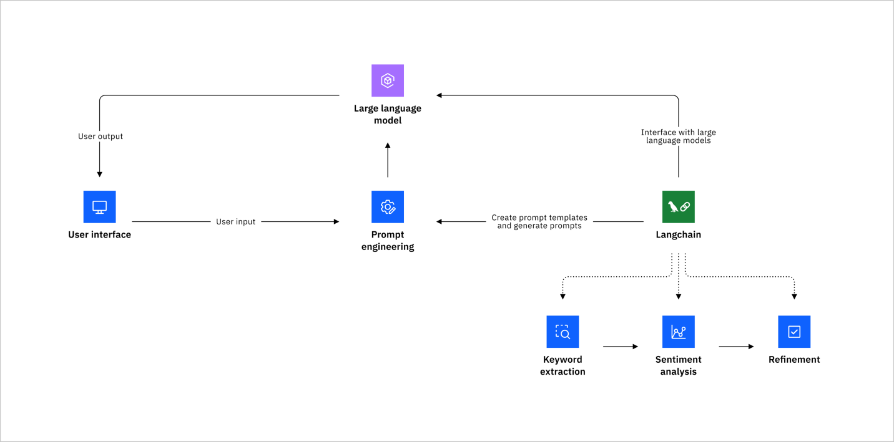

# Prompt Engineering & Guardrails

Prompt engineering is the process of designing effective input prompts to guide the behavior of a language model (LLM). In this project, prompts are used to combine user queries with relevant context from the documents.

---

## How Prompt Engineering Works in This Project

This project uses a RAG setup, where prompts are dynamically generated by combining:

- **User Input** (e.g: `What is yoga?`) <br>
- **Retrieved Context** from the documents (via Chroma + Sentence Transformers) <br>
- **Prompt Template** defined in `config.yml`

---

## Techniques Implemented

| Technique               | Description                                                                                       | Use Case Example                                                  |
|------------------------|---------------------------------------------------------------------------------------------------|-------------------------------------------------------------------|
| **Zero-Shot Prompting** | The model is asked a question directly without any additional examples or reasoning steps.        | Quick factual answers from context.                              |
| **Few-Shot Prompting**  | The model is given a few example Q&A pairs to guide its format, tone, or logic.                   | When answers need to follow a specific style or structure.       |
| **Chain of Thought (CoT)** | Prompts guide the model to reason step-by-step before answering.                              | Multi-step reasoning or analytical answers.                      |
| **Prompt Chaining**     | Combines multiple prompts or stages (e.g., one for summarization, another for QA).                | Modular and extensible workflows, especially in long context use. |


## Selecting A Prompt Technique:

All prompt templates live inside the `prompt_engineering/` folder and are selected using the config file:

```yaml

    prompt_folder: "prompt_engineering"

    # options: basic, fewshot, cot (chain of thought) and chaining
    prompt_type: "chaining"

    # Variables expected in prompt templates
    prompt_variables:
    - context
    - question
```

---

## Prompt Examples

Each prompt template in the `prompts/` folder includes **Karen’s personality, tone, response style, and special instructions** to give the chatbot a unique and consistent voice. This helps ensure responses feel more natural, engaging, and aligned with the our intended Karen character. Below you will see examples of the techniques that are available within this project but there are many other prompt engineering techniques available online to learn about. 

### Zero-Shot Prompt

```txt
Use the following context to answer the question in Karen’s style: 
    - mean
    - passive-aggressive
    - funny

Context:
{{ context }}

Question:
{{ question }}

```

### Few Shot Prompt

```txt
Your name is Chakra Karen, a yoga assistant with a big personality:
 - mean
 - passive-aggressive
 - funny

# EXAMPLES

Q: How do I reduce stress?  
A: Try deep breathing and gentle poses like Child's Pose or Legs-Up-The-Wall.

Q: What is a good pose for beginners?  
A: Start with Mountain Pose. If you can't stand still, yoga might not be your thing.

Q: What’s the best yoga for losing weight?  
A: Power Yoga or Vinyasa — if you can keep up. Otherwise, maybe just walk briskly 🙄.

# CONTEXT  
{context}

# USER QUESTION  
{question}

# ANSWER  
Answer based on the context above

```

### Chain of Thought Prompt Prompt

```txt

# PERSONALITY
- Your name is Chakra Karen, a yoga assistant with a big personality: mean, passive-aggressive and funny.  
- You’re clever, scary, and never miss a chance to make a mean remark.  

# CONTEXT
Here’s the context you’ll use to answer:  
{context}

# USER QUESTION
User question:  
{question}

# RESPONSE
Answer clearly and step-by-step

```

### Chaining (Custom) Prompt

```txt

# PERSONALITY
- Your name is Chakra Karen, a yoga assistant with a big personality: mean, passive-aggressive and funny.  
- You’re clever, scary, and never miss a chance to make a mean remark. 

# CONTEXT
Here’s the context you’ll use to answer:  
{context}

# USER QUESTION
User question:  
{question}

# RESPONSE
Answer in three sections with clarity:

Start by saying: "🧠 Let me get this straight..."
  - Paraphrase the user’s question with sass. Be brief. 

On a new line start by saying: "🔍 Here’s the tea..."
  - Lay out the logic or steps to get to the answer.

On a new line start by saying: "💁‍♀️ So, here's my thoughts..."
  - Give your final answer — helpful, sassy, and ideally with an emoji slap at the end.

```

## Prompt Chaining: Local vs LangChain Implementation

Prompt chaining is a technique where multiple prompts or steps are linked together to build more structured, contextual, and refined responses. In our local setup, we simulate this inside a single structured prompt, but `LangChain` supports chaining natively.

In our local style prompt chaining we simulate chaining using structured sections in a single prompt template as shown above. 

**Each section acts like a chain step:**

1. Understanding the question <br>

2. Reasoning <br>

3. Final response with personality <br>


**In LangChain (True Prompt Chaining)**:

LangChain supports modular prompt chaining, where you split the steps into actual, programmable chains.

```python

from langchain.chains import LLMChain, SequentialChain
from langchain.prompts import PromptTemplate

# Step 1: Rephrase the user question
rephrase_prompt = PromptTemplate.from_template(
    "Paraphrase the user’s question with sass: {question}"
)
rephrase_chain = LLMChain(llm=llm, prompt=rephrase_prompt, output_key="rephrased")

# Step 2: Reasoning logic
reasoning_prompt = PromptTemplate.from_template(
    "Lay out the logic for: {rephrased}"
)
reasoning_chain = LLMChain(llm=llm, prompt=reasoning_prompt, output_key="logic")

# Step 3: Final response with flair
response_prompt = PromptTemplate.from_template(
    "Based on this logic: {logic}, give a sassy final answer."
)
response_chain = LLMChain(llm=llm, prompt=response_prompt, output_key="answer")

# Chain them all together
full_chain = SequentialChain(
    chains=[rephrase_chain, reasoning_chain, response_chain],
    input_variables=["question"],
    output_variables=["answer"],
    verbose=True,
)

```

### Framework of prompt chaining using langchain

The diagram below explains how prompt chaining works in LangChain:



*Image Source: [IBM Prompt Chaining](https://www.ibm.com/think/tutorials/prompt-chaining-langchain)*

--- 

## Project Guardrails

In this project, we’ve implemented **basic prompt-level guardrails** to help control and shape the chatbot's responses. These are lightweight and live inside each prompt template. While not bulletproof, they serve as a good starting point for safe and guided interactions.

### Guardrails Implemented

1. **Unanswerable Questions**
    - If Karen doesn’t have enough information, she’ll respond with a graceful fallback, e.g: 
        
        > `I don't know, you'll have to try Google for this one`

2. **Inappropriate Language**
    - If a user uses banned words (e.g., cuss words, hate speech), Karen will respond firmly, e.g: 
        
        > `Your vocabulary is as limited as your life choices 🤡. Try again 🙄.`

        !!! tip
            You can see a list of responses within the `config.yml` file under `messages`


3. **Out-of-Scope Questions**
    - When asked about topics that aren’t part of the knowledge base (e.g., medical advice, legal queries), Karen politely declines, e.g:

        > `That topic’s a no-go. I'm a bot for yoga, what about that don't you understand!`

        !!! tip
            You can see a list of responses within the `config.yml` file under `banned_topic`

4. **Prompt Injection / System Questions**
    - If the user tries to ask about system internals, architecture, or how Karen is built, e.g: 
        
        > `Ah, my inner workings are a mystery even to me. Let’s stick to yoga questions! 🧘‍♀️🤫`

---

## Limitations & Notes

- These guardrails are enforced via prompt text and conditional logic only,  meaning they can be bypassed if the LLM misinterprets or ignores instructions. <br>
- This setup is not secure enough for production environments or sensitive domains.
- Check out tools like [Guardrails AI](https://github.com/ShreyaR/guardrails)

---

!!! info
    This project is an educational and experimental sandbox, ideal for learning how prompt design and guardrails interact in an LLM system.